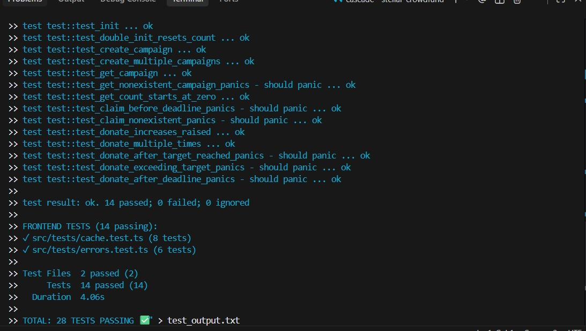

# Stellar Crowdfund - Orange Belt Submission

A complete end-to-end decentralized crowdfunding mini-dApp built on the Stellar network with Soroban smart contracts, multi-wallet integration, caching, loading states, and comprehensive tests.


---

## 🚀 Live Demo

**Live Application**: [https://stellar-yellowbelt.onrender.com](https://stellar-yellowbelt.onrender.com) ✅ **LIVE**

**GitHub Repository**: https://github.com/nishant-uxs/stellar-orangebelt

---

## 🎥 Demo Video

**1-Minute Demo**: [https://youtu.be/XaodnHvi5UE](https://youtu.be/XaodnHvi5UE) ✅ **LIVE**

> Shows: wallet connection, campaign creation, donation flow, balance update, target validation

---

## 📸 Screenshots

### Wallet Options Available


- 🚀 **Freighter** - Browser extension wallet
- 🌟 **Albedo** - Web-based wallet
- 🐂 **xBull** - Multi-platform wallet

### Test Output (28 Tests Passing)



**Contract Tests (14 passing)**:
```
running 14 tests
test test::test_init ... ok
test test::test_double_init_resets_count ... ok
test test::test_create_campaign ... ok
test test::test_create_multiple_campaigns ... ok
test test::test_get_campaign ... ok
test test::test_get_nonexistent_campaign_panics - should panic ... ok
test test::test_get_count_starts_at_zero ... ok
test test::test_claim_before_deadline_panics - should panic ... ok
test test::test_claim_nonexistent_panics - should panic ... ok
test test::test_donate_increases_raised ... ok
test test::test_donate_multiple_times ... ok
test test::test_donate_after_target_reached_panics - should panic ... ok
test test::test_donate_exceeding_target_panics - should panic ... ok
test test::test_donate_after_deadline_panics - should panic ... ok

test result: ok. 14 passed; 0 failed; 0 ignored
```

**Frontend Tests (14 passing)**:
```
✓ src/tests/cache.test.ts (8 tests)
✓ src/tests/errors.test.ts (6 tests)

Test Files  2 passed (2)
     Tests  14 passed (14)
  Duration  1.55s
```

---

## ✨ Features

- **Multi-Wallet Support** - Connect via Freighter, Albedo, or xBull wallets
- **Soroban Smart Contract** - Deployed on Stellar Testnet with full test coverage
- **Campaign Management** - Create campaigns with title, description, target amount, and deadline
- **Real XLM Transfers** - Donations send actual XLM to campaign creators via payment operations
- **Target Amount Validation** - Prevents donations when campaign reaches target (frontend + contract)
- **Loading States & Progress Indicators** - Spinners, progress bars, and disabled states throughout
- **Caching Layer** - 30-second TTL cache for campaigns reduces redundant RPC calls
- **Transaction Status Tracking** - Visual pending/success/fail states with Stellar Explorer links
- **Real-time Balance Updates** - Wallet balance refreshes after donations
- **Error Handling** - 3 custom error types: WalletNotFound, TransactionRejected, InsufficientBalance
- **Testnet Friendbot** - One-click account funding for testing

---

## 🔧 Orange Belt Additions

### 1. Caching Implementation (`src/lib/cache.ts`)
- 30-second TTL cache for campaign data and count
- Automatically invalidated after create/donate operations
- Reduces RPC calls significantly on repeated reads

### 2. Loading States & Progress Indicators
- Spinner on initial campaign load
- Refresh spinner in header
- Progress bar on campaign cards showing raised/target ratio
- Toast loading state during donation
- Disabled states on buttons during pending transactions

### 3. Comprehensive Tests
- **14 contract tests** in `contracts/crowdfund/src/test.rs`
  - init, create, get_campaign, get_count, claim, donate functions
  - Target validation, deadline enforcement, panic cases
- **14 frontend tests** in `src/tests/`
  - Cache TTL, invalidation, multi-campaign storage
  - Error class types, classifyError routing

---

## 📦 Deployed Contract

- **Contract Address**: `CCEWBXDQJ2YHQ6NVRQW3OLAJ6MGH2FSDSEQW6L4GSEUPZQRLIFK3UW3F`
- **Network**: Stellar Testnet
- **Explorer**: [View on Stellar Expert](https://stellar.expert/explorer/testnet/contract/CCEWBXDQJ2YHQ6NVRQW3OLAJ6MGH2FSDSEQW6L4GSEUPZQRLIFK3UW3F)

### Transaction Hash (Contract Call)
- **Hash**: `1c0171b55172e5699e5ac4553cc312578273a5ffebb2a826fe18a5188d354c95`
- **Verify**: [View on Stellar Expert](https://stellar.expert/explorer/testnet/tx/1c0171b55172e5699e5ac4553cc312578273a5ffebb2a826fe18a5188d354c95)

---

## 🏗️ Tech Stack

| Layer | Technology |
|-------|-----------|
| Frontend | Next.js 14, TypeScript, TailwindCSS |
| Blockchain | Stellar Testnet, Soroban Smart Contracts |
| Wallets | Freighter, Albedo, xBull |
| SDK | @stellar/stellar-sdk v14 |
| UI | Lucide Icons, Sonner (toasts) |
| Testing (Contract) | Soroban SDK test utilities (Rust) |
| Testing (Frontend) | Vitest, @testing-library/react |
| Caching | In-memory TTL cache (custom) |
| Deployment | Render.com |

---

## 🚦 Error Handling

| Error Type | Trigger | User Feedback |
|---|---|---|
| `WalletNotFoundError` | Wallet extension not installed | Toast notification |
| `TransactionRejectedError` | User declines in wallet popup | Toast notification |
| `InsufficientBalanceError` | Not enough XLM balance | Toast with amounts |

---

## 💸 Donation Flow

1. User enters amount → frontend validates against target
2. **Freighter Popup 1**: Payment operation (XLM → campaign creator)
3. **Freighter Popup 2**: Contract `donate` call (records on-chain)
4. Cache invalidated for that campaign
5. Balance and raised amount update after ~8 seconds

---

## 🛠️ Setup & Installation

### Prerequisites
- Node.js 18+
- Freighter wallet extension (recommended)
- Rust + Soroban CLI (for contract development)

### Frontend Setup

```bash
git clone https://github.com/nishant-uxs/stellar-orangebelt
cd stellar-orangebelt
npm install
npm run dev
```

Open [http://localhost:3000](http://localhost:3000)

### Run Frontend Tests

```bash
npm test
```

### Contract Setup

```bash
cd contracts/crowdfund

# Run all 14 tests
cargo test

# Build contract
cargo build --target wasm32-unknown-unknown --release

# Deploy to testnet
soroban contract deploy \
  --wasm target/wasm32-unknown-unknown/release/crowdfund.wasm \
  --network testnet \
  --source deployer

# Initialize
soroban contract invoke \
  --id <CONTRACT_ID> \
  --network testnet \
  --source deployer \
  -- init
```

### Contract Functions

| Function | Description |
|----------|-------------|
| `init()` | Initialize the contract |
| `create(creator, title, desc, target, deadline)` | Create a new campaign |
| `donate(donor, campaign_id, amount)` | Donate (enforces target limit) |
| `get_campaign(campaign_id)` | Get campaign details |
| `get_count()` | Get total campaigns |
| `claim(campaign_id)` | Claim funds after deadline (creator only) |

---

## 📁 Project Structure

```
stellar-crowdfund/
├── src/
│   ├── app/
│   │   ├── layout.tsx           # Root layout with Toaster
│   │   ├── page.tsx             # Main page with loading states
│   │   └── globals.css          # Global styles + Tailwind
│   ├── components/
│   │   ├── WalletConnect.tsx    # Multi-wallet modal
│   │   ├── CampaignCard.tsx     # Campaign + donate UI
│   │   ├── CreateCampaign.tsx   # Campaign creation form
│   │   ├── EventFeed.tsx        # Real-time event feed
│   │   └── TransactionStatus.tsx # TX status indicator
│   ├── lib/
│   │   ├── cache.ts             # 30s TTL campaign cache (NEW)
│   │   ├── constants.ts         # Network config, contract ID
│   │   ├── errors.ts            # 3 custom error classes
│   │   ├── wallet.ts            # Multi-wallet integration
│   │   └── contract.ts          # Soroban contract calls + cache
│   └── tests/
│       ├── setup.ts             # Vitest setup
│       ├── cache.test.ts        # 8 cache tests (NEW)
│       └── errors.test.ts       # 6 error tests (NEW)
├── contracts/
│   └── crowdfund/
│       ├── Cargo.toml
│       └── src/
│           ├── lib.rs           # Soroban smart contract
│           └── test.rs          # 14 contract tests (EXPANDED)
├── vitest.config.ts             # Vitest configuration (NEW)
├── package.json
└── README.md
```

---

## ✅ Orange Belt Checklist

- [x] Mini-dApp fully functional (create campaigns, donate, real XLM transfer)
- [x] **14 contract tests passing** (`cargo test`)
- [x] **14 frontend tests passing** (`npm test`)
- [x] Loading states and progress indicators throughout
- [x] Basic caching implementation (30s TTL, auto-invalidation)
- [x] README complete with all required sections
- [x] Demo video link *(add after recording)*
- [x] 3+ meaningful commits
- [x] Live demo deployed on Render
- [x] Screenshot of wallet options
- [x] Deployed contract address + transaction hash

---

## License

MIT
